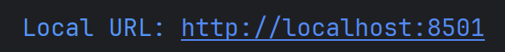

# 🔧 Download and Usage 🔧
<div align ="center">

> *This section will give you thorough download and usage instruction*

</div>


### Step 1: Prepare Docker
To run this application, you must have Docker installed on your system.

Please download and install the version of Docker Desktop that matches your Operating System plus chip architecture here:

* [**Download Docker Desktop**](https://www.docker.com/products/docker-desktop/)

> **⚠️ Important Note:** This project was developed and rigorously tested on **Windows**. While Docker is cross-platform, we cannot currently guarantee smooth performance on macOS or Linux distributions.

### Step 2: Start Docker
Once installed, open the **Docker Desktop** application on your computer. Wait until the engine has fully started (the status bar in the app will turn green).

You can activate Docker using terminal/powershell (window) by running ```docker desktop start``` (note that this cmd might differ across Linux/MacOS and Window) 
or click on app shortcut.


### Step 3: Build the Image
Open your terminal (Command Prompt, PowerShell, or Terminal) inside the main project directory and run the following command.
*(Note: You can replace `image_name` with a name of your choice).*

```bash
docker build -t image_name .
```
> **⚠️ Important Note:** The total runtime could last somewhere between 35 to 51 minutes.

### Step 4: Run the app in localhost
After downloading finishes, you can now run the program and use it locally with:

```bash
docker run -p 8501:8501 image_name
```

Note that you must replace the ```image_name``` with the name you used to build your
image above. And, as testing proves only port 8501 works as local host, I recommend user using this.

However you can run test, if your laptop show anything other than 8501 please map accordingly as 8502:8501; 8080:8501 (Note that
the port of docker container is 8501 so the second port number must be 8501).

